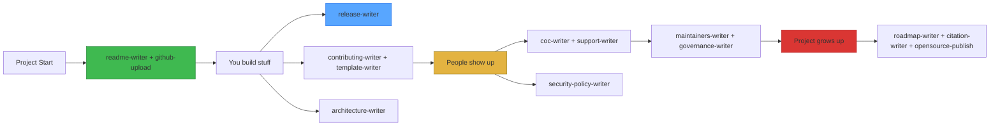

<div align="center">
  <h1>📚 Open Source Doc Toolkit</h1>
  <p><strong>14 Claude Code skills that write every document your open-source project needs —<br>so you can stop staring at a blank README and start shipping.</strong></p>

  [](https://github.com/QT7-C23/open-source-doc-toolkit)
  [](LICENSE)
  [](#whats-inside)

  🌐 **English** | [中文](README_CN.md)
</div>

## The problem this solves

You built something useful. It works. Now you need to put it on GitHub — but the blank `README.md` is staring back at you. Then someone asks "do you have a code of conduct?" and "how do I report a security issue?" and "what's your roadmap?" 

You end up spending more time writing **about** the code than writing the code.

This toolkit gives Claude 14 specialized brains for documentation. You say "write me a security policy" — it writes one. No staring at blank pages, no googling templates, no "all PRs welcome" cop-outs.

## What it downloads

These aren't generic templates. Each skill has a structured thinking process — it explores your project first, asks you questions, then writes. Like a technical writer who reads your code before touching the keyboard.

| Skill | What You Say | What You Get |
|-------|-------------|--------------|
| `readme-writer` | "Write me a README" | A landing page that answers what, why, and how-to-try in 10 seconds |
| `github-upload` | "Upload this to GitHub" | .gitignore → README → license → commit → push, all at once |
| `contributing-writer` | "How should people contribute?" | Step-by-step setup + PR checklist + code conventions |
| `template-writer` | "Set up issue templates" | YAML forms that force bug reporters to actually be useful |
| `release-writer` | "Write release notes for v1.2" | SemVer bump + Keep a Changelog entry + GitHub Release body |
| `architecture-writer` | "Document how this system works" | arc42-style doc with C4 diagrams and ADRs |
| `roadmap-writer` | "What's the plan?" | Honest roadmap with confidence levels — no fake promises |
| `coc-writer` | "Add a code of conduct" | Contributor Covenant 2.1 with your enforcement email |
| `security-policy-writer` | "How do people report vulnerabilities?" | Private reporting flow + supported versions table |
| `support-writer` | "Where should people ask for help?" | Routes users to the right channel |
| `maintainers-writer` | "Who runs this project?" | Current maintainers + roles + how to join |
| `governance-writer` | "How are decisions made?" | BDFL or consensus-based — honest, not aspirational |
| `citation-writer` | "How should academics cite this?" | CITATION.cff + auto Zenodo DOI setup |
| `opensource-publish` | "Set up translation + coverage + funding" | Weblate, Codecov, Open Collective — one at a time, not all at once |

## Get it

```bash
npx skills add QT7-C23/open-source-doc-toolkit
```

Or copy manually:
```bash
cp -r skills/* ~/.claude/skills/
```

Then just talk to Claude. Each skill triggers when you mention its domain.

## The small things that add up

- **Every skill asks one question at a time.** No "pick from these 8 options" walls of text. Visual AskUserQuestion popups.
- **Every skill audits your project first.** Then writes. Never hallucinates a Node.js setup for your Python project.
- **Every skill has a self-review checklist.** It checks its own work before showing you.
- **Every skill adapts to the platform.** README for npm? Shorter, no Mermaid. For GitHub? Full treatment with badges and star history.
- **Simple projects get simple docs.** No "Governance" for a solo maintainer's weekend toy.

## What's inside

```
skills/
├── readme-writer/SKILL.md          # Where every project starts
├── github-upload/SKILL.md          # Getting it online
├── contributing-writer/SKILL.md    # Welcoming contributors
├── template-writer/SKILL.md        # Structured issue forms
├── architecture-writer/SKILL.md    # How the system fits together
├── release-writer/SKILL.md         # Shipping versions
├── roadmap-writer/SKILL.md         # Where you're headed
├── coc-writer/SKILL.md             # Community standards
├── security-policy-writer/SKILL.md # Safe reporting
├── support-writer/SKILL.md         # Help channels
├── maintainers-writer/SKILL.md     # Who's in charge
├── governance-writer/SKILL.md      # How decisions are made
├── citation-writer/SKILL.md        # Academic credit
└── opensource-publish/SKILL.md     # Platform integrations
```

14 plain Markdown files. No dependencies. No build step. They live in your `~/.claude/skills/` and work wherever Claude Code does.

## How it flows



## License

MIT — use freely, modify freely, credit appreciated.

## Built on the shoulders of

[Contributor Covenant](https://www.contributor-covenant.org/) · [Keep a Changelog](https://keepachangelog.com/) · [arc42](https://arc42.org/) · [C4 Model](https://c4model.com/) · [MVG](https://github.com/github/MVG) · [Diátaxis](https://diataxis.fr/) · [othneildrew/Best-README-Template](https://github.com/othneildrew/Best-README-Template)
