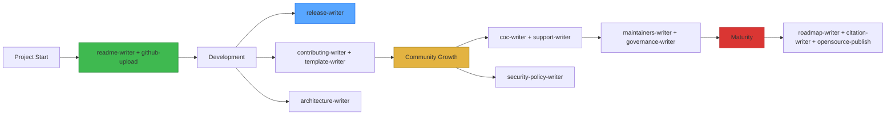

<div align="center">
  <h1>📚 Open Source Doc Toolkit</h1>
  <p><strong>14 Claude Code skills to write every document your open-source project needs — professionally, consistently, and without overthinking.</strong></p>

  [](https://github.com/QT7-C23/open-source-doc-toolkit)
  [](LICENSE)
  [](#skills)

  🌐 **English** | [中文](README_CN.md)
</div>

## 🚀 Quick Start

### 1. Install
**One command:**
```bash
npx skills add QT7-C23/open-source-doc-toolkit
```

**Or manually:** copy the `skills/` folder to `~/.claude/skills/`

### 2. Use
Just tell Claude what you need:
> "Write a README for my project"
> "Create a security policy"
> "Help me upload this to GitHub"

Each skill triggers automatically when you mention its domain.

## 📋 Skills

| # | Skill | Produces |
|---|-------|----------|
| 1 | `readme-writer` | README.md — project landing page |
| 2 | `github-upload` | Repository initialization & first push |
| 3 | `contributing-writer` | CONTRIBUTING.md — how to contribute |
| 4 | `template-writer` | Issue/PR YAML templates |
| 5 | `architecture-writer` | ARCHITECTURE.md — system design |
| 6 | `release-writer` | CHANGELOG.md — version releases |
| 7 | `roadmap-writer` | ROADMAP.md — future plans |
| 8 | `coc-writer` | CODE_OF_CONDUCT.md — community standards |
| 9 | `security-policy-writer` | SECURITY.md — vulnerability reporting |
| 10 | `support-writer` | SUPPORT.md — help channels |
| 11 | `maintainers-writer` | MAINTAINERS.md — who runs this |
| 12 | `governance-writer` | GOVERNANCE.md — decision making |
| 13 | `citation-writer` | CITATION.cff — academic citation |
| 14 | `opensource-publish` | Weblate/Codecov/Zenodo integration |

## ✨ Features

| Feature | Description |
|---------|-------------|
| 🧠 **Structured workflow** | Each skill follows Hard Gate → Q&A → Draft → Self-Review → User Review |
| 🌍 **Platform-agnostic** | Works for GitHub, GitLab, Gitee, npm, PyPI, standalone docs |
| 🎯 **AskUserQuestion UI** | Visual choice selection — no text-based A/B/C guessing |
| 📝 **Battle-tested templates** | Based on Contributor Covenant, Keep a Changelog, arc42, C4 model, MVG |
| 🔄 **Progressive disclosure** | Simple projects get simple docs; complex projects get full depth |

## 🏗️ Architecture



## 📄 License

MIT — use freely, modify freely, credit appreciated.

## 🙏 Acknowledgments

Built with lessons from:
- [Contributor Covenant](https://www.contributor-covenant.org/) (CoC template)
- [Keep a Changelog](https://keepachangelog.com/) (changelog format)
- [arc42](https://arc42.org/) (architecture documentation)
- [C4 Model](https://c4model.com/) (architecture diagrams)
- [MVG](https://github.com/github/MVG) (Minimum Viable Governance)
- [Diátaxis](https://diataxis.fr/) (documentation framework)
- [othneildrew/Best-README-Template](https://github.com/othneildrew/Best-README-Template)
