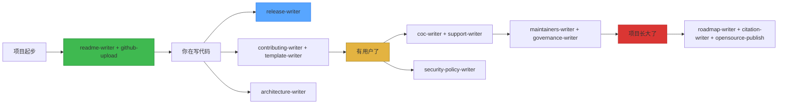

<div align="center">
  <h1>📚 开源文档全家桶</h1>
  <p><strong>14 个 Claude Code 技能——让你的开源项目不再面对空白 README 发呆，<br>张嘴就写出专业文档。</strong></p>

  [](https://github.com/QT7-C23/open-source-doc-toolkit)
  [](LICENSE)
  [](#技能清单)

  🌐 [English](README.md) | **中文**
</div>

## 它解决什么问题

你做了个有用的东西。写好了代码，准备传到 GitHub——然后对着空白的 `README.md` 大脑一片空白。接着有人问"有没有行为准则？""怎么报告安全漏洞？""你们的路线图呢？"

结果你花在写文档上的时间比写代码还多。

这个工具包给 Claude 装了 14 个专业的文档大脑。你说"帮我写一个安全策略"——它就写出来。不用对着空白页发呆，不用 Google 模板，不用敷衍了事。

## 它写什么

这些不是通用模板。每个技能都有结构化的思考流程——先探索你的项目，再向你提问，最后动笔。像一个先看代码再下笔的技术文档工程师。

| 技能 | 你说 | 你得到 |
|-------|-------------|--------------|
| `readme-writer` | "帮我写 README" | 10 秒回答"什么/谁/怎么试"的项目门面 |
| `github-upload` | "上传到 GitHub" | .gitignore → README → LICENSE → commit → push，一步到位 |
| `contributing-writer` | "别人怎么参与贡献？" | 开发环境搭建 + PR 检查清单 + 代码规范 |
| `template-writer` | "设置 Issue 模板" | 强制填写关键信息的 YAML 表单 |
| `release-writer` | "写 v1.2 的发布说明" | SemVer 版本号 + Keep a Changelog + GitHub Release |
| `architecture-writer` | "文档化系统架构" | arc42 架构文档 + C4 图 + 架构决策记录 |
| `roadmap-writer` | "下一步计划是什么？" | 带置信度的诚实路线图——不画饼 |
| `coc-writer` | "加行为准则" | Contributor Covenant 2.1 + 你的举报邮箱 |
| `security-policy-writer` | "怎么上报漏洞？" | 私密报告流程 + 支持版本表 |
| `support-writer` | "哪里可以求助？" | 把用户引导到正确的求助渠道 |
| `maintainers-writer` | "谁在维护这个项目？" | 当前维护者 + 角色 + 如何加入 |
| `governance-writer` | "怎么决策的？" | BDFL 或共识制——诚实不演戏 |
| `citation-writer` | "学术怎么引用？" | CITATION.cff + 自动 Zenodo DOI |
| `opensource-publish` | "接翻译/覆盖率/捐赠平台" | Weblate、Codecov、Open Collective——按需集成 |

## 装上就用

```bash
npx skills add QT7-C23/open-source-doc-toolkit
```

或手动复制：
```bash
cp -r skills/* ~/.claude/skills/
```

然后跟 Claude 说话就行。每个技能在提到对应领域时自动触发。

## 细节里的功夫

- **每次只问一个问题。** 不会让你从 8 个选项里挑花眼。可视化 AskUserQuestion 弹窗。
- **每个技能先审计你的项目再动手。** 不会给你的 Python 项目写一个 Node.js 的开发环境搭建指南。
- **每个技能有自审查清单。** 它写完会自己检查一遍再给你看。
- **每个技能适配不同平台。** npm 的 README？去掉 Mermaid，缩短。GitHub？全套 badge + Star 历史。
- **简单项目得简单文档。** 不会给个人周末玩具写一份"项目治理"文档。

## 技能清单

```
skills/
├── readme-writer/SKILL.md          # 每个项目从这里开始
├── github-upload/SKILL.md          # 把代码推上去
├── contributing-writer/SKILL.md    # 欢迎贡献者
├── template-writer/SKILL.md        # 结构化 Issue 表单
├── architecture-writer/SKILL.md    # 系统怎么拼在一起的
├── release-writer/SKILL.md         # 版本发布
├── roadmap-writer/SKILL.md         # 未来要往哪走
├── coc-writer/SKILL.md             # 社区行为准则
├── security-policy-writer/SKILL.md # 安全漏洞上报
├── support-writer/SKILL.md         # 求助渠道
├── maintainers-writer/SKILL.md     # 谁在管这个项目
├── governance-writer/SKILL.md      # 决策怎么做的
├── citation-writer/SKILL.md        # 学术引用
└── opensource-publish/SKILL.md     # 平台集成
```

14 个纯 Markdown 文件。不依赖任何东西，不需要构建。放在 `~/.claude/skills/` 下，Claude Code 在哪都能用。

## 项目生命周期



## 协议

MIT — 自由使用，自由修改，欢迎署名。

## 站在巨人的肩膀上

[Contributor Covenant](https://www.contributor-covenant.org/) · [Keep a Changelog](https://keepachangelog.com/) · [arc42](https://arc42.org/) · [C4 Model](https://c4model.com/) · [MVG](https://github.com/github/MVG) · [Diátaxis](https://diataxis.fr/) · [othneildrew/Best-README-Template](https://github.com/othneildrew/Best-README-Template)
